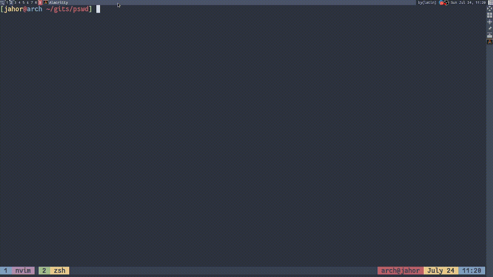

# pswd — password manager written in Go
It will store encrypted passwords in `$HOME/.config/pswd/pswd.db`.

## Add password
`echo "passphrase key value" | go run pswd.go add`

## Get passwords
`echo "passphrase" | go run pswd.go get`

## Example using Rofi and Xclip
```sh
pswd_cmd="pswd"
choice=$(echo -e "Add password\nGet all passwords" | rofi -dmenu)

if [[ "$choice" == "Add password" ]]
then
    passphrase=$(echo "Enter passphrase" | rofi -dmenu )
    key=$(echo "Enter target" | rofi -dmenu )
    password=$(echo "Enter password" | rofi -dmenu )
    echo "$passphrase $key $password" | $pswd_cmd add
else
    passphrase=$(echo "Enter passphrase" | rofi -dmenu )
    echo $passphrase | $pswd_cmd get | rofi -dmenu | cut -d "[" -f2 | cut -d "]" -f1 | xargs | xclip -selection clipboard
fi
```



